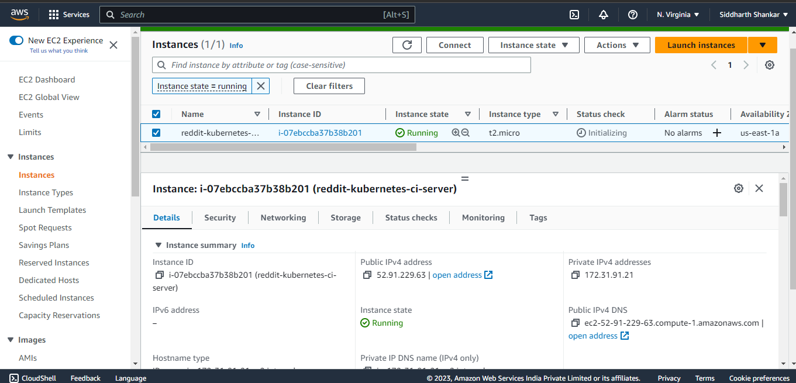
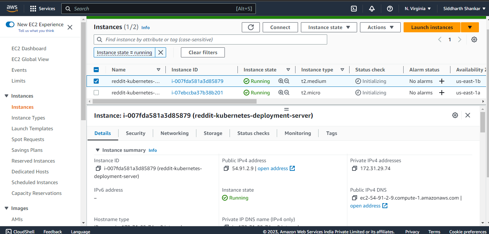
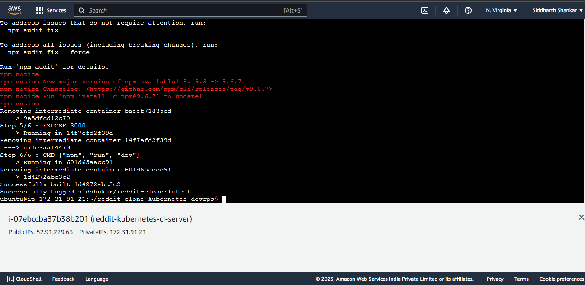
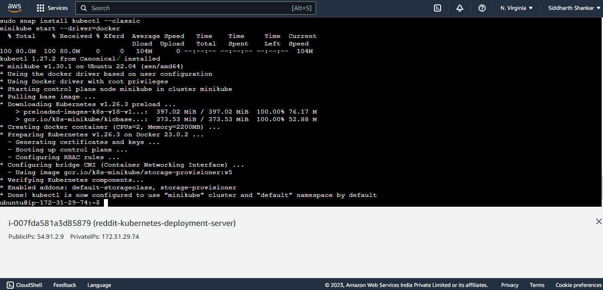
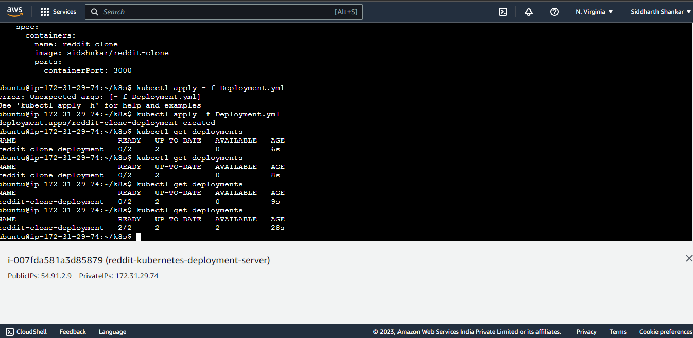
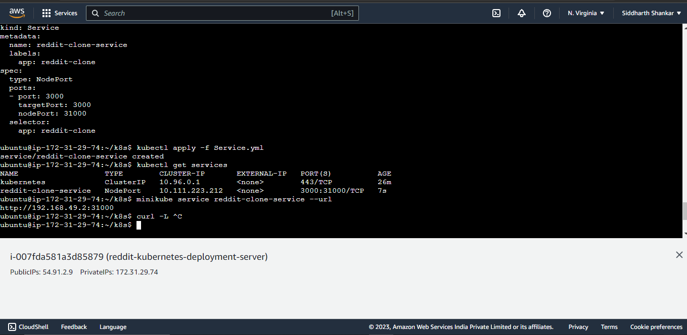
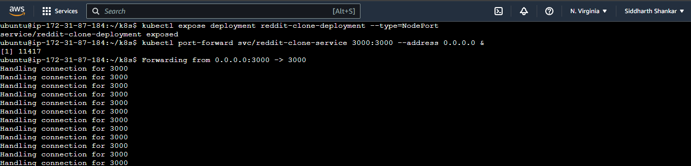
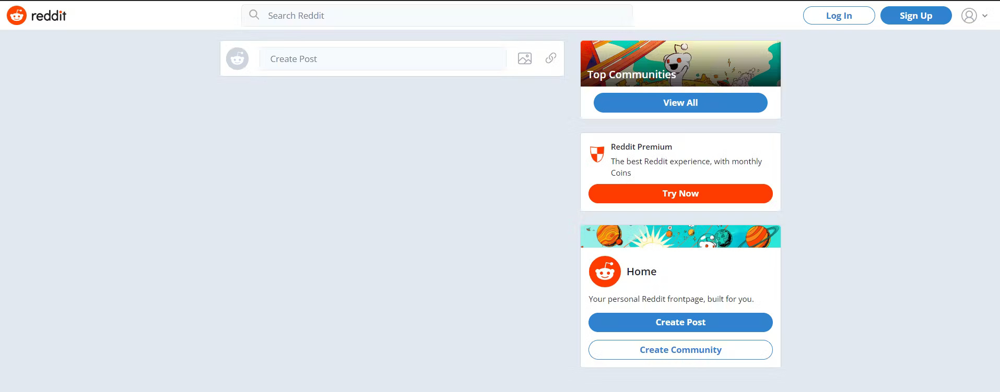
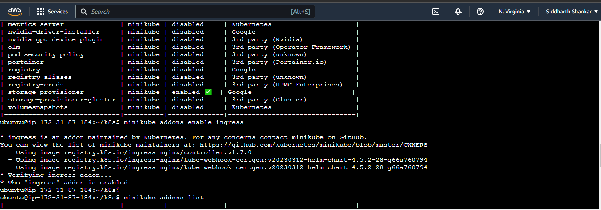
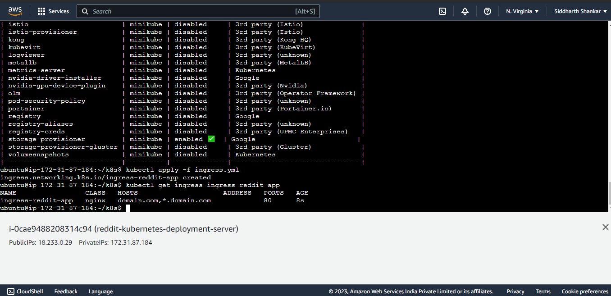

# reddit-clone-kubernetes-devops

Configuration details: 
1. **CI server EC2 instance name:** reddit-kubernetes-ci-server (t2.micro)
2. **Deployment server EC2 instance name:**  reddit-kubernetes-deployment (t2.medium)
3. **Docker reddit app docker hub image name :** reddit-clone
4. **Kubernetes reddit app deployment name :** reddit-clone-deployment
5. **Kubernetes reddit app service name :** reddit-clone-service
6. **Kubernetes reddit app ingress name :** ingress-reddit-app
7. **App URL format -** http://EC2_INSTANCE_PUBLIC_IP_ADDRESS:3000


<!-- TABLE OF CONTENTS -->
## Table of Contents

* [About the Project](#about-the-project)
  * [Description](#description)
  * [Technologies](#technologies-used)
  * [Screenshots](#screenshots)
* [Getting Started](#getting-started)
  * [Prerequisites](#prerequisites)
  * [Commands used](#commands-used)


<!-- ABOUT THE PROJECT -->
## About The Project

### Description
Deployed the Reddit app clone on Kubernetes cluster with ingress, using AWS and Docker. Provisioned two **AWS EC2** instances - CI server for building and pushing the **docker** image to docker hub, and Deployment server for deploying the app on **kubernetes** cluster and creating a service to expose it to the public internet. Also used **Ingress** for routing the traffic coming to the cluster IP to a domain name.

### Technologies used
1. AWS EC2
2. Kubernetes (with Ingress)
3. Docker
4. GitHub


### Screenshots


&nbsp;&nbsp;&nbsp;&nbsp;

&nbsp;&nbsp;&nbsp;&nbsp;

&nbsp;&nbsp;&nbsp;&nbsp;

&nbsp;&nbsp;&nbsp;&nbsp;

&nbsp;&nbsp;&nbsp;&nbsp;

&nbsp;&nbsp;&nbsp;&nbsp;

&nbsp;&nbsp;&nbsp;&nbsp;

&nbsp;&nbsp;&nbsp;&nbsp;

&nbsp;&nbsp;&nbsp;&nbsp;

&nbsp;&nbsp;&nbsp;&nbsp;
<!-- GETTING STARTED -->
## Getting Started

To get started with the project, follow these steps:

### Prerequisites

* AWS account
* GitHub account

### Commands used

**Note:** 
* Make sure to enable port 3000 inbound traffic while creating the EC2 instance or edit the security group if you already have created it.

* On CI server, for docker installation

```sh
sudo apt-get update
```
```sh
sudo apt-get install docker.io -y
```
```sh
sudo usermod -aG docker $USER && newgrp docker
```

* On Deployment server, for Kubectl and Minikube installation

```sh
curl -LO https://storage.googleapis.com/minikube/releases/latest/minikube-linux-amd64
```
```sh
sudo install minikube-linux-amd64 /usr/local/bin/minikube 
```
```sh
sudo snap install kubectl --classic
```
```sh
minikube start --driver=docker
```

* For building the docker image from Dockerfile and pushing it to docker hub registry
```sh
docker . build -t sidshnkar/reddit-clone
```
```sh
docker login
```
```sh
docker push sidshnkar/reddit-clone
```

* On Deployment server, for deploying to Kubernetes

```sh
mkdir k8s
nano Deployment.yml
kubectl apply -f Deployment.yml
```

* To verify the deployments on kubernetes
```sh
kubectl get deployments
```

* Creating a service for our kubernetes deployment
```sh
nano Service.yml
kubectl apply -f Service.yml
kubectl get services
```

* For accessing the application that you have created with Deployment.yml from our linux server itself
```sh
minikube service reddit-clone-service — url
curl -L http://192.168.49.2:31000
```

* For exposing our deployment to public
```sh
kubectl expose deployment reddit-clone-deployment --type=NodePort
```
* Do the port forwarding for Port 3000
```sh
kubectl port-forward svc/reddit-clone-service 3000:3000 –address 0.0.0.0 &
```

Now the reddit app clone can be accessed from http://EC2_INSTANCE_PUBLIC_IP_ADDRESS:3000

* For enabling ingress from minikube
```sh
minikube addons enable ingress
```
* For creating an ingress file and running it
```sh
nano ingress.yml
kubectl get ingress ingress-reddit-app
```
Now the app can also be opened from ``` curl -L <YOUR_DOMAIN_NAME>/<PATH_PREFIX> ``` where domain name and path prefix are as specified by
you in ingress.yml.
